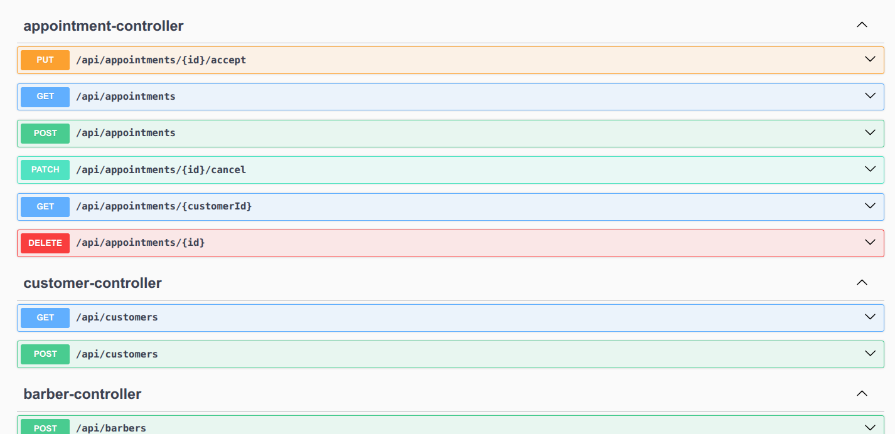

# Barbershop App   
A backend system for managing barbers, customers, and appointments, built with Spring Boot and PostgreSQL. 
Notification Email system implementing for real time information about appointments (requested, confirmed, cancelled)

## Getting Started
1. Clone the repository: (SSH)
```
git clone git@github.com:lukasilverio94/barber_app.git
cd barber_app
```
## Requirements
- Java 21+ 
- Maven 3.6+
- Docker (optional, for running PostgreSQL container)
- Postman/Insomnia or any REST client (optional for testing API)

## Project structure

The application follows a layered architecture:

**Controllers**: Handle HTTP requests and responses

**Services**: Services: Contain business logic 

**Repositories**: Handle data access operations

**DTOs**: Data transfer objects for API contracts

**Models (Entities)**: Domain models mapped to database tables

**Exceptions**: Custom exception handling

**Security**: Authentication and authorization configuration

**Validation**: Validators logic

## ✨Features
- JWT Authentication (Spring Security) -> Uses email/password to log in
- Role-based Access(CUSTOMER, BARBER)
- Appointment creation and management by Customers and Barbers
- Email Notification System after appointment is created and confirmed
- CRUD Operations for Barber and Customers 

## Database Setup

#### Using Docker (Recommended)
Run PostgreSQL container locally:
```
docker-compose up -d
```

The container exposes Postgres on port 5432.

Database name: barberapp
Username: postgres
Password: postgres


## Running the app:

#### Build the project:
`./mvnw clean package`

#### Run with Maven
`./mvnw spring-boot:run`

The application will start on http://localhost:8080/

### Running Tests 
To run tests with the test profile:
`./run-test-profile.sh`

## API Overview
- **Authentication**: /auth
- **Appointments**: /appointments
- **Barbers**: /barbers
- **Customers**: /customers

Refer to the controller classes under com.barbershop.controller for full endpoints and request mappings.

## Access Documentation
You can check the endpoints on: `http://localhost:8080/swagger-ui/index.html`


## Notes 
- The app uses single-table inheritance for AppUser with discriminator column user_type.
- Appointment times must be between 8:00 AM and 8:00 PM.
- Barbers have availability set per day of the week (barber_availability table).
- Email notification in real time using SMTP.
- Adjust database credentials and connection in application.yml if needed.
- If you change entity classes, remember to update the database migration or run with ddl-auto: update cautiously.
- Appointments last 30 minutes by default.

## Troubleshooting
- Port conflicts: If port 5432 is in use, change Docker Postgres port or local DB port.
- Database connection issues: Confirm DB is running and credentials match those in config.
- Missing database types: Ensure the enum user_type is created in Postgres before running the app.
- JWT/security errors: Check SecurityConfig.java and token validity.

Feel free to reach out if you need help setting it up or want to extend the functionality!

